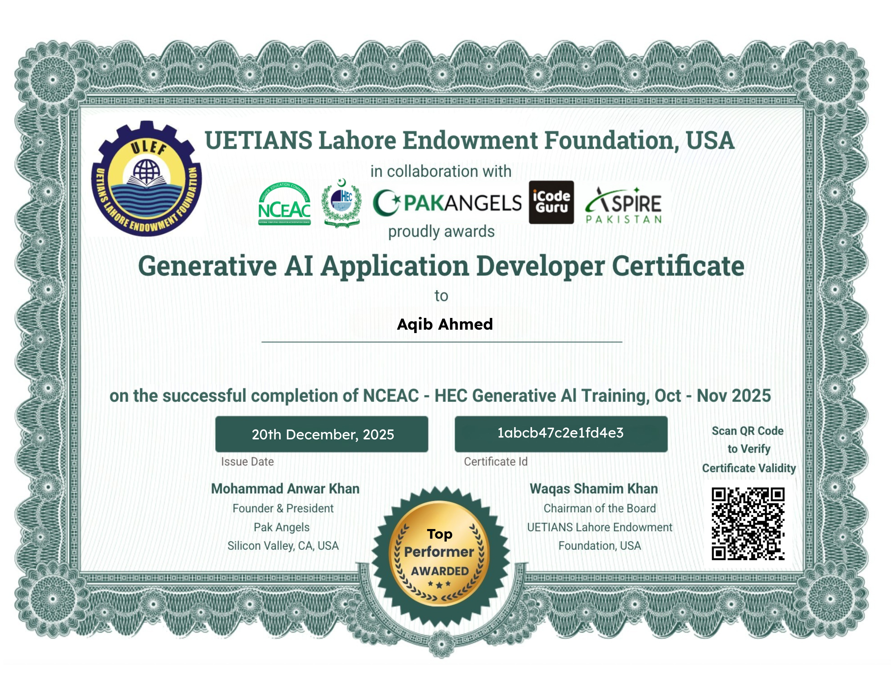

<div align="center">

<!-- Animated wave header -->


<!-- Animated typing SVG -->


<br/>

<!-- Badges row -->
<a href="https://github.com/Aqibahmed12">
  
</a>
&nbsp;

&nbsp;


</div>

---


## 👨‍💻 About Me

```python
class AqibAhmed:
    name        = "Aqib Ahmed"
    location    = "Sindh, Pakistan 🇵🇰"
    university  = "Aror University of Art, Architecture,"
                  "Design & Heritage"
    focus       = ["AI / ML", "Computer Vision",
                   "NLP", "Generative AI"]
    building    = "AI tools that solve real problems"
    learning    = ["Deep Learning", "LLMs", "MLOps"]
    fun_fact    = "My Chess AI beats me every time 😅"
    open_to     = "Internships & Collaborations"
```

<br/>

- 🔭 Currently building **AI-powered web apps & CV systems**
- 🌱 Exploring **Large Language Models & Generative AI**
- 💼 Open to **internship opportunities & collaborations**
- 🏆 13+ Projects across AI, CV, NLP & Game Dev
- 📍 Based in **Pakistan** • Student at **Aror University**
- ⚡ Fun fact: I built an AI that generates full websites from a single sentence!

<br clear="right"/>

---

## 🌐 Connect With Me

<div align="center">

[](https://linkedin.com/in/)
[](mailto:your@email.com)
[](https://github.com/Aqibahmed12)
[](https://instagram.com/)
[](https://facebook.com/)

</div>

---

## 🛠️ Tech Stack

<div align="center">

### 👨‍💻 Languages


### 🤖 AI / Machine Learning


### 🌐 Web & Frameworks


### 🗄️ Databases & DevTools


</div>

---

## 🚀 Featured Projects

<div align="center">

| 🏷️ Project | 📝 Description | 🔧 Tech Stack |
|:---:|:---|:---:|
| [**👁️ FaceAttend Pro**](https://github.com/Aqibahmed12/Face-Detection-Attendance-System) | Face recognition attendance with **anti-spoofing**, live dashboard & Excel export | `dlib` `OpenCV` `CustomTkinter` `SQLite` |
| [**🌐 NexaBuild**](https://github.com/Aqibahmed12/NexaBuild) | AI generates a **complete website** from a single text prompt with live preview | `Python` `Generative AI` `HTML/CSS/JS` |
| [**🤖 Website-Builder-AI**](https://github.com/Aqibahmed12/Website-Builder-Ai) | Generative AI website builder with **downloadable source code** | `Python` `AI` `Flask` |
| [**📝 ThesisMate**](https://github.com/Aqibahmed12/ThesisMate) | AI-powered **thesis writing & research assistant** | `Python` `NLP` `Generative AI` |
| [**⚙️ AutoML for SMEs**](https://github.com/Aqibahmed12/AutoML-for-small-businesses) | **No-code AutoML** pipeline for small businesses | `Scikit-learn` `Streamlit` |
| [**♟️ Chess Master**](https://github.com/Aqibahmed12/Chess-Master) | Chess AI with **Minimax + Alpha-Beta pruning** — plays at human level | `Python` `Tkinter` `pygame` |
| [**🌾 Crop Yield AI**](https://github.com/Aqibahmed12/AI-driven-crop-yield-prediction) | AI-driven agricultural **yield forecasting** model | `Python` `ML` `Pandas` |
| [**🎬 Movie Recommender**](https://github.com/Aqibahmed12/Movie-Recommendation-System) | Content-based **recommendation engine** using cosine similarity | `Python` `NLP` |
| [**📧 Spam Classifier**](https://github.com/Aqibahmed12/Email-Spam-Classifier) | NLP-powered **email spam detection** | `Python` `NLTK` `ML` |
| [**👥 Customer Segmentation**](https://github.com/Aqibahmed12/Customer_Segmentation) | K-Means **clustering** for customer behavior analysis | `Python` `Scikit-learn` |

</div>

---

## 📊 GitHub Statistics

<div align="center">


<br/><br/>


</div>

---

<hr>
<details open> 
  <summary><h2>★ Certificates & Acheivements</h2></summary>
    <a href="asset/HEC-GenAi.jpg">
 
</a><br>
<a href="asset/Google Data Analytics Certificate-1.png">
 
</a>
<a href="asset/Planerary Defender.png">
 
</a>
<a href="asset/Certificate Of Completion Artificial Intelligence Case Studies in Different Business Industries-1.png">
 
</a>
<a href="assets/pandasworkshop.png">
 
</a><br>  
<a href="assets/mlsapython.jpg">
 
</a>
<a href="assets/mlsaAI.jpg">
 
</a>
<a href="assets/mlsaML.jpg">
 
</a>
<a href="asset/Data Science Job Simulation_completion_certificate-1.png">
 
</a>   
</details> 

<div align="center">

---

## 🏆 GitHub Trophies

<div align="center">
  
</div>

---

## 📈 Contribution Activity

<div align="center">
  
</div>

---

## 🐍 Contribution Snake

<div align="center">
  <picture>
    <source media="(prefers-color-scheme: dark)" srcset="https://raw.githubusercontent.com/Aqibahmed12/Aqibahmed12/output/github-snake-dark.svg" />
    <source media="(prefers-color-scheme: light)" srcset="https://raw.githubusercontent.com/Aqibahmed12/Aqibahmed12/output/github-snake.svg" />
    
  </picture>
</div>

---

## 💡 Random Dev Quote

<div align="center">
  
</div>

---

<div align="center">

### 🎯 "The goal of AI is not to replace human intelligence — but to amplify it."

<br/>

**⭐ If you find my projects useful, please give them a star! It motivates me to build more. ⭐**

<br/>

<!-- Footer wave -->


</div>
